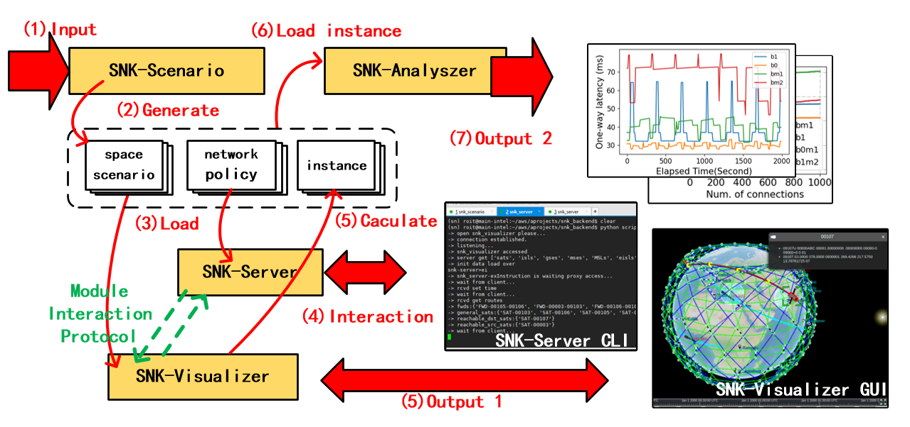
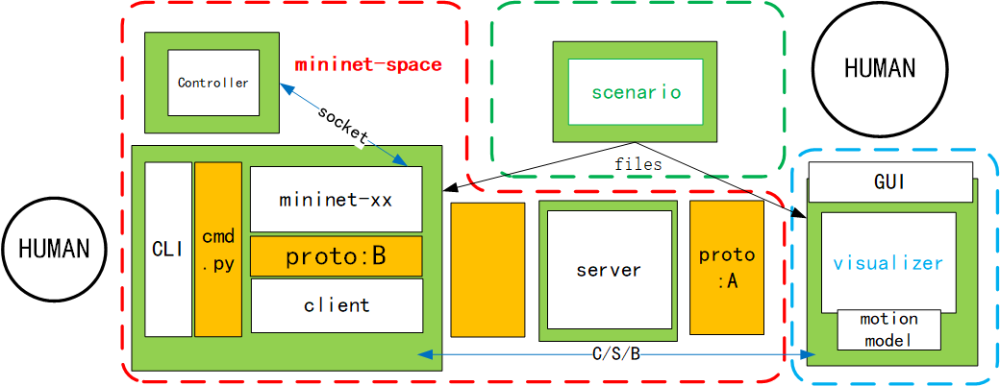
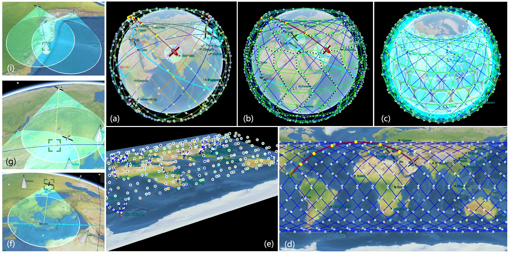
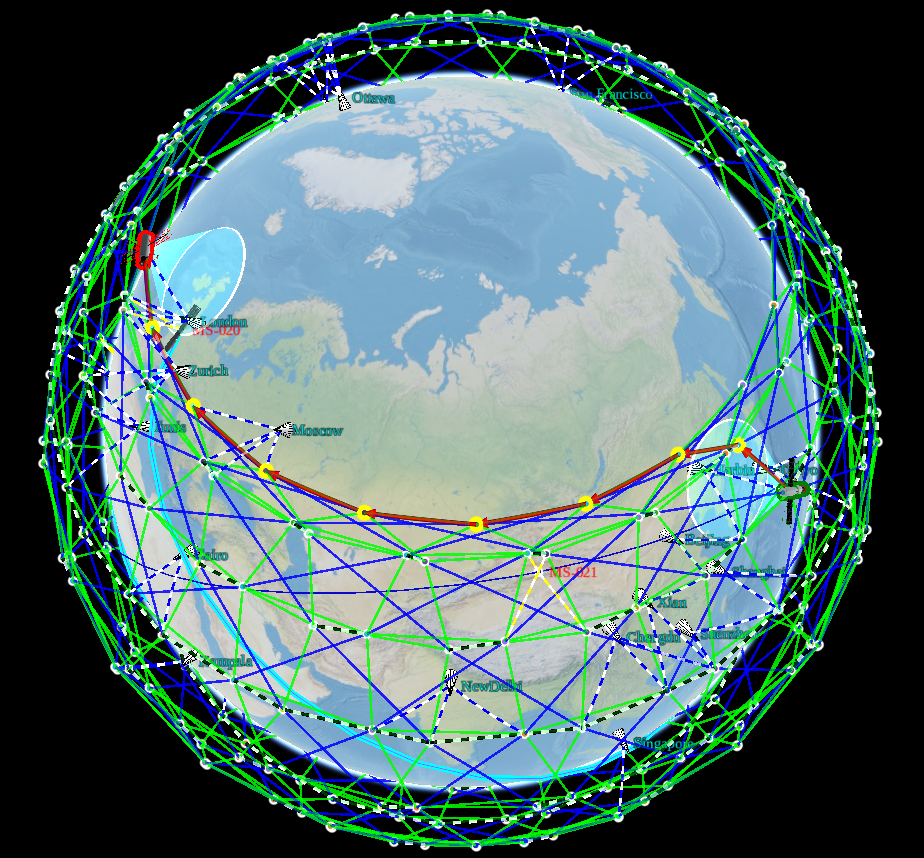
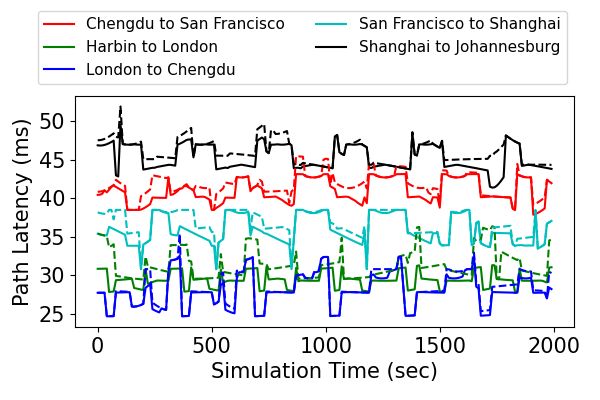
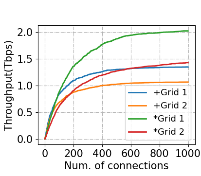
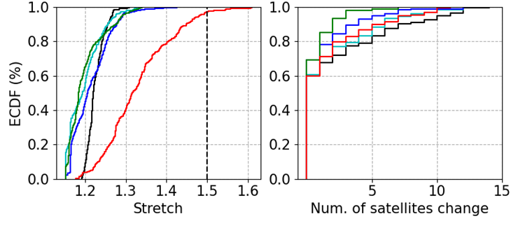

# Space Networking Kit

English | [中文文档](README_ch.md)

A simulation\emulation system for space networking.


*SNK* is a simulation\emulation  platform designed to evaluate the network performance of constellation systems for global Internet services.  SNK offers real-time communication visualization and supports the simulation of routing between edge node of network.  The platform enables the evaluation of routing and network performance metrics such as latency, stretch, network capacity, and throughput under different network structures and density.   The effectiveness of SNK is demonstrated through various simulation cases, including the routing between fixed edge stations or mobile edge stations and analysis of space network structures.

This framework contains:
- snk-scenario
- snk-visualizer
- snk-server
- snk-analyzer

# SNK workflow



# SNK arch




# scenario






# evaluation






# USING 

```
#snk-scenario
1. edit cfg file and bash run.sh


#snk-visualizer
1. mv scenario_dir that generated by snk-scenario to ./snk-scenario/data/

2. cp CesiumJs dir to ./snk-scenario/

3. open http-server and browser 

```

# citation

```
@inproceedings{snk,
title={Space Networking Kit: A Novel Simulation Platform for Emerging LEO Mega-constellations},
author={Xiangtong, Wang and Xiaodong, Han and Menglong, Yang and Songchen, Han and Wei Li}
booktitle={IEEE International Conference on Communications 2024},
year={2024}
}

```
