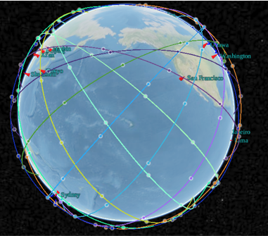
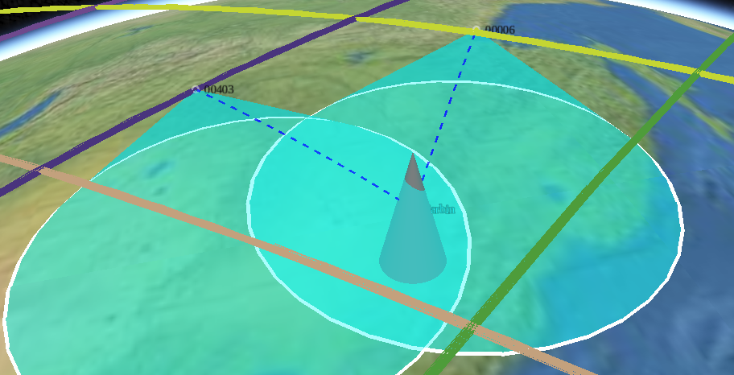
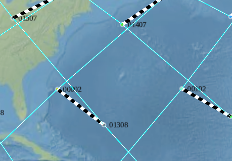
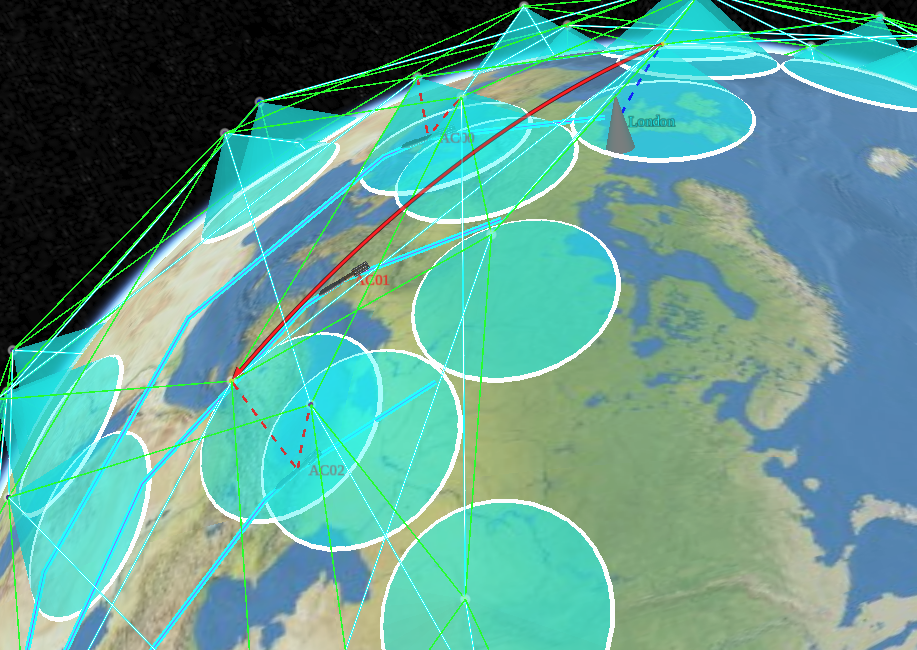

# spaceflow

English | [中文文档](README_ch.md)

A emulation\simulation framework of space network.


*spaceflow* is a simu/emulation framework that enables the simulation of space, such as satellites, vehicles, interstellar links, etc., as well as the networking emulation among above entities. This framework enables the development of new protocols, architectures and managements in space networks.


This framework contains three parts:
- [scenario](https://github.com/xdr940/scenario)
- mininet-space 
- [visualizer](https://github.com/xdr940/visualizer)


*scenario* is used to build the simulation scenario of space network and generate the CZML file required by the *visualizer*.

*mininet-space*  is a network emulator, which is based on mininet and still under development. It is temporarily embedded in the whole framework with the [visualizer-backend](https://github.com/xdr940/visualizer-backend) as a substitute to achieve basic operation.

*visualizer* is a visualization tool, not only to visualize the scene generated by the *scenario*, but also to connect to the *mininet-space(visualizer-backend)*, to visualize the network process.

## scenario

This includes satellites (SATs), ground stations (GSs), vehicles (ACs), sensors, forwarders (FWDs), and links.
The links include inter-satellite links (ISLs), satellite-ground links (GSLs), vehicle-satellite links (ASLs), and temporary constructed links (tISLs).

Construction sequence.
    `SAT.py -> ISL.py -> FWD.py`
    `GS.py -> GSL.py`
    `SAT.py -> ISL.py -> tISL.py`
    `ACs.py -> ASL.py`


## visualizer

- SAT


- GS

- GSL

- ISL


- FWD


- tISL


- ASL



## cite
```tex
@misc{spaceflow,

author={Wang Xiangtong},

title={SpaceFlow},
year = {2022},

howpublished={\url{https://github.com/xdr940/spaceflow}}

}


```