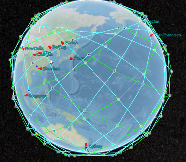
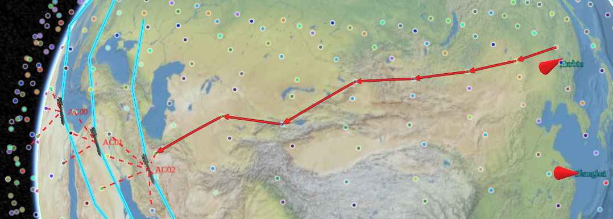

# Space Networking Kit

[English](README.md) | 中文文档

空间网络的仿真\模拟框架。


*snk* 是一个仿真/模拟框架，可以对空间进行仿真，例如巨星座、车辆、飞行器、舰船、星间链路等，以及上述实体之间的网络模拟，实现iperf、ping的测量。该框架支持在空间网络中开发新的设施架构、协议架构和管理架构。该框架包含三个部分：*Scenario*、*mininet-space* 和*Visualizer*，现逐个介绍


## 关键单元

### 1.*scenario*


*scenario*为一组用户程序，用于构建空间网络的模拟场景，针对生成*visualizer*需要的`*.czml`文件，以及针对*mininet-space*生成`*.plc`文件制定网络过程。
`*.czml`文件和`*.plc`文件是仿真场景在空间和网络两个方面的不同抽象，但具有一致性，例如同一个节点在空间部分的`*.czml`文件中和和网络部分的`*.plc`文件中具有同一ID，链路等其他单元也是类似。

### 2.*visualizer*

*visualizer*是一个基于*Cesium*的Web端可视化工具，不仅可以将*scenario*生成的场景可视化，还可以连接到*mininet-space(visualizer-backend)*，将网络过程可视化。

### 3.*mininet-space*

*mininet-space* 是一个基于mininet 的网络仿真器，在整个框架中起主干部分，也是整个框架中最复杂的部分，目前以*visualizer-backend*暂时嵌入到整个框架中，以作为替代，实现基本操作。
在主体结构中，可以根据功能分为四个部分：核心子系统、CLI子系统、外部程序调用的API子系统和网络评估子系统。另外，控制器代码执行在另一个进程中，通过socket和网络仿真器交互，这里暂不讨论。

**CLI（Command Line Interface）子系统**：是用户和网络模拟器的交互接口，通过拓展mininet 命令集实现交互。拓展命令除了核心子系统的操作还包括visualizer操作（例如空间部分的开始和停止，图层的显示、隐藏等）、评估子系统（EVA）的操作等拓展。

**核心子系统**：是以mininet为基础，能根据`*.plc`文件，构建与空间场景能相互映射的网络场景，实现网络仿真的基本保障。其与mininet、mininet-space最重要的不同是添加了两个特性：
- 节点运动模型并非运行在本地进程空间而是在visualizer内；
- 节点距离变化导致的传播时延计算要在链路(link)属性中实时更新。

另外，现有核心子系统中传播模型较少，并且执行在主进程空间，在节点数量少的场景性能瓶颈不严重，后期需要将其通过异步编程，提升结点数量较多场景下的性能。


**API子系统**：主要负责网络仿真器与外部程序、其他仿真单元的交互功能。API的实现是通过开启一个独立线程，来承载Websocket服务器，并通过自定义协议，实现高通量数据交互（包括上千节点的位置或者上万个链路长度等信息）。为此，我们根据仿真需求，设计了仿真单元数据交互协议（Simulation Unit Data Interaction protocol, SUDI），并以JSON数据格式传输。


**EVA子系统**：EVA是对网络进行可视化评估的子系统，目前实现了通过matplotlib对端到端时延、可见性、星座统计等信息的可视化演示，后期计划将其融合到SUDI中，并在visualizer中显示。

## 对子课题的支撑

仿真模拟系统的目的之一是为了支撑子课题合同指标的验证，现对各个部分的支撑验证作用进行说明。

**空间设施架构和网络协议架构设计**：为了实现空间设施架构的演示，通过*Scenario*构建场景，并通过Visualizer以GUI形式，实现动态交互场景下，任意角度观察网络组成，实现多种可见性分析。对于网络协议架构，以mininet-space单元中构建虚拟网络，形成Visualizer中空间设施架构的高保真映射。


**接入与切换**：以mininet-space为支撑，尤其是其中的API子系统过程记录为验证的重要依据。我们在链路层提供新的专用链路对象`SpaceLink` 和专用无线接口`IntfSpace`对象，实现新的链路层协议。visualizer的时间系统能够以1ms或更短的时间片为单位，运行场景，这为50ms的切换过程演示提供了基础。

1. 首先确定两颗随遇卫星$s_1,s_2$，在visualizer内通过时间轴手动调节到即将接入的时刻，通过mininet-space的CLI系统操作，初始化仿真所需前置信息，并开启PCAP trace功能记录网络内数据帧，然后以1ms为单位进行场景播放。其中，$s_1$下面关联了一个终端$a_1$，一直运行着目的网络地址为$s_2$的ping程序，在接入之前程序持续返回`Unreachable`状态。

2. $s_1,s_2$互相进入关联范围，此时visualizer中会出现斑纹状线条样式，代表着已经达到建链条件，当接入成功后，$a_1$中ping程序返回RTT值，网络正式联通。

3. 结束场景后，通过`WireShark`网络封包分析软件，打开捕获到的包，以其中一个卫星接收到探针包的时刻，开始计时，直到网络层协议包流通开始，计时结束，经过时间验证是否小于50ms。


**路由**

  对网络层构建新的路由转发设备，并在控制器上部署新的强化学习路由算法实现高效路由。路由过程通过API子系统传递到Visualizer，实时观察数据转发。另外API子系统的Replay模式能够将网络过程的实例文件传递到visualizer重现过程
  
**传输**
  针对对传输层编写新型传输协议，部署在虚拟终端，并记录流量和窗口信息，与传统TCP、UDP比较。通过EVA子系统查看窗口和流量过程。


## cite
```tex
@misc{snk,
author={Wang Xiangtong},
title={Space Networking Kit},
year = {2022},
howpublished={\url{https://github.com/xdr940/snk}}
}
```




